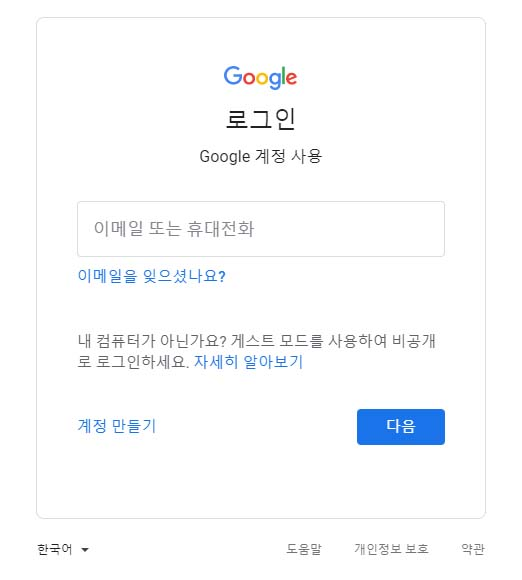
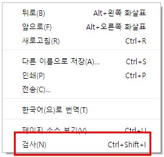
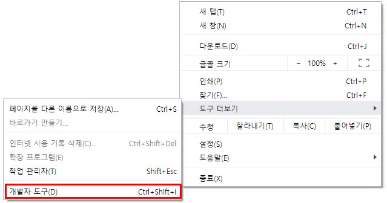

# 구글 포토 전체 삭제 자동화 도구 머릿말
감사하게도 [@mrishab](https://github.com/mrishab) 님이 잘 만들어주신 [google-photos-delete-tool](https://github.com/mrishab/google-photos-delete-tool)이, 몇 가지 이유(1. 버튼 이름이 한국어임 / 2. 삭제버튼 클래스가 다름)로 한국어 구글 포토에서는 정상 작동하지 않아, 한국어 구글 포토에 맞게 수정하였음. 이에 아래 자료를 한국어로 번역하고 한국어에서 정상 작동하게 수정함. ([@gomgom](https://github.com/gomgom))

# 구글 포토 전체 삭제 자동화 도구 (Google Photos Delete All Tool)
당신이 만약 수천장의 [구글 포토](https://photos.google.com/) 사진을 지우고 싶지만, 쉬운 방법을 찾지 못하였다면, 이 도구가 당신에게 도움이 될 수 있을 것입니다. 이 스크립트는 구글 포토 데스크탑용 앱에서 모든 사진을 지워줄 것입니다. 당신은 작동하는 과정도 볼 수 있습니다!

# 시작하기에 앞서
아래의 과정을 순서대로 따라 주세요.

## 준비물
- 최근 버전의 웹 브라우저가 필요합니다. 이 스크립트는 구글 크롬(v71.0.3578.98, 역자: v77.0.3865.120에서도 정상 작동) 외에 다른 브라우저에서는 테스트되지 않았습니다. 필요하다면 [최근 버전의 구글 크롬을 여기](https://www.google.com/chrome/)에서 다운받으실 수 있습니다. 그러나, 당신은 구글 크롬 외에도 [파이어폭스](https://www.mozilla.org/en-US/firefox/download/thanks/) 또는 [MS 엣지 브라우저](https://www.microsoft.com/en-ca/windows/microsoft-edge) 등 다른 브라우저 또한 사용 가능합니다.

## 기타 사항
이 메뉴얼은 구글 크롬 브라우저에서 작동하는 것을 전제로 만들어졌습니다. 혹시 다른 브라우저를 사용한다면, 어떤 것은 같을 수 있으나 키보드 단축키 또는 브라우저 별로 다른 단어를 사용할 수 있습니다.

## 단계
1) [사진을 삭제할 구글 계정에 로그인합니다](https://accounts.google.com/ServiceLogin).



2) [구글 포토](https://photos.google.com/)로 이동합니다.


_참고: 만약에 구글에 정상 로그인이 되었다면, 당신의 구글 포토 이미지가 표시됩니다._

3) 개발자 도구를 실행합니다. 아래 세 가지 옵션 중 편한 방법을 사용하세요.

    - **키보드 단축키**
        
        `CTRL + SHIFT + I`를 순차적으로 눌러 실행합니다.

    - **페이지 빈 공간으로부터**
        
        빈 공간을 오른쪽을 눌러 마지막에 있는 '검사(N)'를 누릅니다.
        
        

    - **상단 메뉴로부터**
        
        1) 메뉴 버튼()을 누릅니다. (기본적으로 브라우저 우측 상단에 위치합니다.)
        
        2) '도구 더보기'를 누릅니다.
        
        3) '개발자 도구'를 누릅니다.
        
        

4) 개발자 도구가 열렸으면, 'Console' 탭을 누릅니다.
    
    
    ```
    참고: _이 창은 이 도구처럼 당신이 원하는 코드를 실행해 주는 도구입니다! 혹시 개발자 도구 콘솔에 대하여 궁금하시다면 [구글 콘솔 페이지](https://developers.google.com/web/tools/chrome-devtools/console/)에서 더 알아보실 수 있습니다._
    ```
    
    ```
    콘솔에서 구글이 적어 둔 경고를 보실 수 있습니다. 이 콘솔을 사용하면 공격자가 Self-XSS라는 공격을 통해 내 신원을 도용하여 개인 정보를 빼낼 수 있습니다. 알지 못하는 코드를 입력하거나 붙여넣지 마세요.
    ```

5) [delete_photos.js](https://github.com/gomgom/google-photos-delete-tool/blob/master/delete_photos.js)에 있는 모든 소스 코드를 복사하여, 콘솔에 붙여 넣습니다.
    

6) 준비가 되었으면 **엔터**키를 누릅니다. 엔터를 누르고 잠시 뒤 소스 코드가 실행됩니다.

7) 다 됐습니다! 사진이 꾸준히 삭제되는 모습을 보실 수 있습니다. (역자: 창을 끄지 마시고 그대로 컴퓨터를 두십시오.)

# 기타

이 스크립트는 당신의 인터넷 속도가 매우 느린 경우에는 잘 작동하지 않을 수 있습니다. 그런 경우에는, `delete_cycle`와 `press_button_delay`에 적혀 있는 숫자를 적절히 늘려주십시오(단위: 밀리세컨드(ms)). 새로운 코드를 작동시키기 위해서는 새로 고침 후 소스 코드를 다시 실행해 주십시오.
